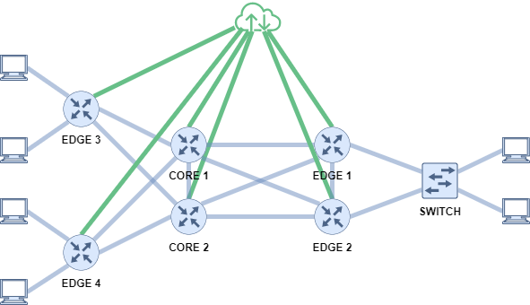

# Ansible Playbook for NetAut Network
## Description
This project was part of the Network Automation module at the Ostschweizer Fachhochschule. The goal of it is to use an ansible playbook to configure the routers of a given network. The network topology is as follows:



The playbook should take information from a services.yaml file and configure the routers as written in it. For this example the routers are in sides: Edge 1 and 2 are "side-A", edge 3 is in "side-B" and edge 4 in "side-C". 

## Preparation
### Install Ansible
It is advised to generate a virtual python environment for this project by:
```sh
python -m venv .venv
source .venv/bin/activate
```
To have ansible work install it using pip:
```sh
pip install ansible
```
For ansible to be able to login on a system with SSH using password, the tool sshpass is needed:
```sh
sudo apt-get -qq update && sudo apt-get -qq install sshpass
```
And disable the Host Key checking:
```sh
export ANSIBLE_HOST_KEY_CHECKING=False
```
Install the Python libary ansible-pylibssh and set the group vars for router to use it as well as the network_cli connection: 
```sh
pip install ansible-pylibssh
mkdir -p group_vars
cat >> group_vars/router.yaml <<EOF
ansible_connection: ansible.netcommon.network_cli
ansible_network_cli_ssh_type: libssh
ansible_network_os: cisco.ios.ios
EOF
```
## Usage
The playbook can be run by entering:
```sh
ansible-playbook -i inventory.yaml hello_world.yaml -k
```
## Filter Plugin
This Ansible filter plugin is designed to be used with a network configuration playbook. It provides two filters that help with the configuration of router interfaces based on a set of provided services and their associated sides.

### Filters
1. nested_service_interfaces
This filter takes a list of services as input and returns a nested list of tuples containing each service and its associated interfaces.
2. filter_router_interfaces
This filter takes a list of services and a router side (e.g., "side-A", "side-B", etc.) as input. It filters the services and returns a list of tuples containing the service and its associated interfaces that match the specified router side.

### Usage
To use this filter plugin in your playbook, place the Python script in a folder named filter_plugins within the same directory as your playbook. Ansible will automatically discover and load the filter plugin.

In your playbook, you can use the provided filters as follows:
```yaml
# Using the nested_service_interfaces filter
- name: configure interfaces
  ...
  loop: "{{ services | nested_service_interfaces }}"
  ...

# Using the filter_router_interfaces filter
- name: configure interfaces for side-A
  ...
  loop: "{{ services | filter_router_interfaces('side-A') }}"
  ...
```